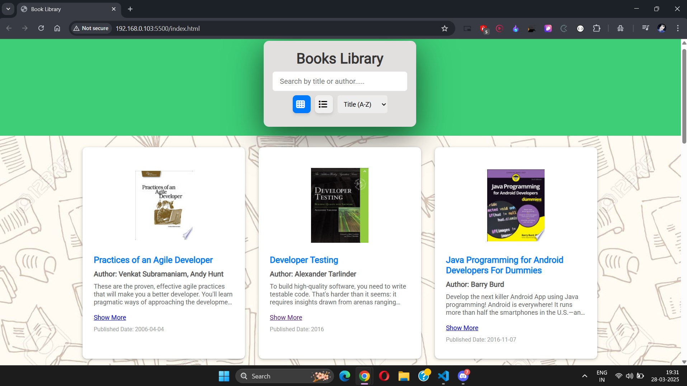
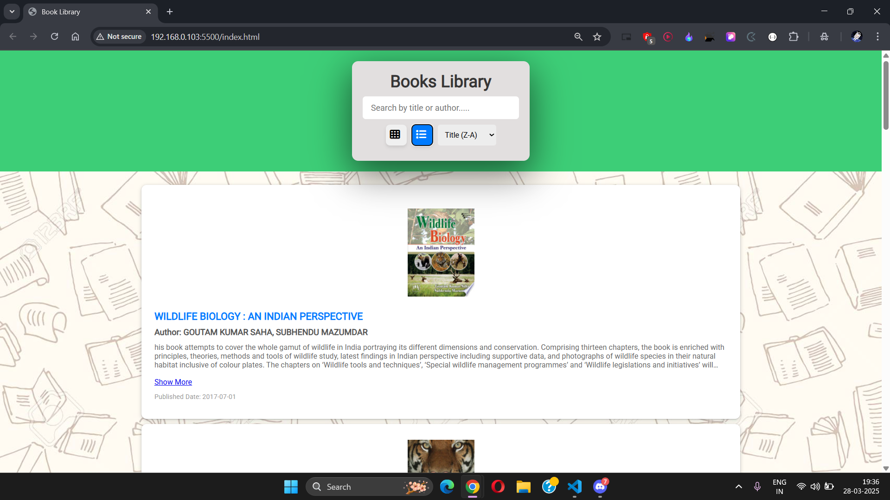

# Cohort-Assignments
# Books Library

## Overview
Books Library is a user-friendly web application that dynamically fetches and displays book data using [FreeAPI.app](https://freeapi.app). It provides intuitive features like list/grid views, search, sort, and pagination to enhance the browsing experience.

## Features
1. Fetch books from the FreeAPI and display them dynamically.
2. Toggle between list and grid view.
3. Show book details including:
   - Title
   - Author
   - Publisher
   - Published Date
   - Thumbnail
4. Implement search functionality to filter books by title or author.
5. Implement sorting functionality based on:
   - Title (Alphabetical order)
   - Published Date (Ascending order)
6. Implement pagination to fetch and display more books.
7. Clicking on a book opens detailed information in a new tab using `infoLink`.

## Tech Stack
- **HTML**: Structure the webpage.
- **CSS**: Style the elements.
- **JavaScript**: Handle API requests, dynamic rendering, search, sorting, and pagination.

## Deployment
[Add Deployment Link Here]

## API Endpoint
- **GET**: `https://api.freeapi.app/api/v1/public/books`

## Screenshot
Grid view

List view

